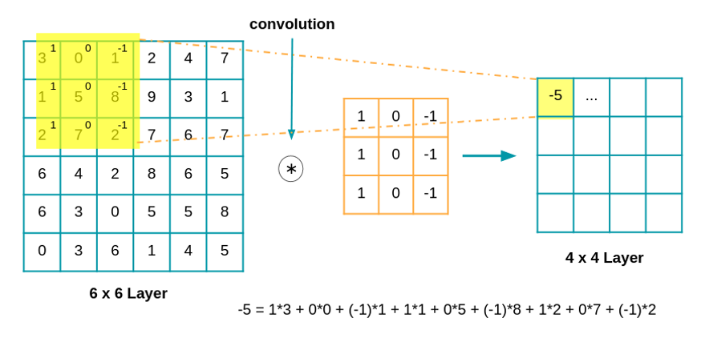

### MOS 4.4 : Nouvelles Technologies de l'Information et de la communication
### Thomas Brisson - 2020/2021

*Cette veille technologique s'effectue dans un cadre académique comme action de formation de l'Ecole Centrale de Lyon, mais aussi dans un cadre professionnel en tant qu'associé et responsable technique d'OOrion, une start-up qui vise à développer une application mobile pour aider les déficients visuels au quotidien.*

# Introduction

## Des besoins et des solutions

Selon l'OMS, 253 millions de personnes présentent une déficience visuelle, 36 millions d’entre elles étant aveugles. En France, ce sont près de 1,7 million de personnes sont atteintes d’un trouble de la vision [1]. Ces personnes sont quotidiennement confrontées à des difficultés pour s'adapter à un environnement très visuel. Pour beaucoup d'entre eux, il est compliqué d'être autonome et des situations du quotidien peuvent alors devenir de réels défis : se déplacer, faire ses courses, faire du sport, faire la cuisine, trouver et consulter du contenu sur internet, retrouver des objets perdus et autour de soi, et bien d'autres. Par ailleurs, le développement des algorithmes d'apprentissage automatique depuis la fin du siècle précédent combiné à l'explosion de la puissance de calcul des ordinateurs a permis un récent essor dans le domaine dit de "l'Intelligence Artificielle". Ces progrès conceptuels et technologiques donnent l'espoir d'offrir, dès maitenant ou d'ici quelques années, plus d'autonomie aux personnes atteintes d'un handicap visuel.

## Brève histoire de l'Intelligence Artificielle

Dans les années 1930, Alan Turing développe pour la première fois sa théorie de la calculabilité, qui suggérait qu'une machine, en utilisant des symboles aussi simples que "0" et "1", pouvait simuler toute déduction mathématique imaginable. Cette idée, selon laquelle les ordinateurs numériques peuvent simuler n'importe quel processus de raisonnement formel, est connue sous le nom de thèse de Church-Turing, ce qui, avec les découvertes simultanées en neurobiologie, en théorie de l'information et en cybernétique, a conduit les chercheurs à envisager la possibilité de construire un cerveau électronique. Le premier travail qui est maintenant généralement reconnu comme traitant de l'intelligence artificielle a été réalisé par McCullouch et Pitts en 1943 sur les "neurones artificiels" complets de Turing.

Entre 1950 et 1975, le terme d'intelligence artificelle voit le jour et la recherche sur le sujet se développe, pleine d'espoir concernant son futur. La période qui suit est appellée "L'hivers de l'IA" car elle représente une certaine désillusion sur le sujet, incarnée par l'absence de financement pour la recherche. Au début des années 1980, la recherche en IA a été relancée par le succès commercial des systèmes experts, une forme de programme d'IA qui simulait les connaissances et les compétences analytiques des experts humains. Dans les années 80, le développement des transistors a permis la création d'une technologie de réseau neuronal artificiel. Le domaine regagne alors de l'intérêt et les recherches et expérimentations se multiplient.

À la fin des années 1990 et au début du 21e siècle, l'IA a commencé à être utilisée dans de nombreux domaines. En 2011, lors d'un match d'exhibition du jeu Jeopardy, le système de réponse aux questions d'IBM, Watson, a battu les deux plus grands champions. Des ordinateurs plus rapides, des améliorations algorithmiques et l'accès à de grandes quantités de données ont permis des avancées dans l'apprentissage et la perception des machines. Les méthodes d'apprentissage profond (Deep Learning), voient le jour. En mars 2016, AlphaGo a remporté 4 des 5 parties de Go lors d'un match avec le champion Lee Sedol, devenant ainsi le premier système de jeu de Go sur ordinateur à battre un joueur professionnel sans handicap. 

En 2020, les systèmes de traitement du langage naturel (NLP) tel que GPT-3 (de loin le plus grand réseau neuronal artificiel) égalent les performances humaines sur certains points. L'AlphaFold 2 de DeepMind a démontré la capacité à déterminer, en quelques heures plutôt qu'en quelques mois, la structure 3D d'une protéine. La reconnaissance faciale a progressé au point où, dans certaines circonstances, certains systèmes prétendent avoir un taux de précision de 99%. [2]

## Une veille à 3 niveaux

Il est important de noter que cette veille technologique s'intéresse aux récentes innovations dans certains domaines de l'intelligence artificielle qui pourraient potentiellement améliorer les outils pour déficients visuels existants ou mener à de nouvelles solutions concrètes dans ce domaine, mais aussi aux solutions déjà existantes, en passant par celles encore à l'état de prototype.

# Etat de l'Art de l'IA en tant qu'outils pour déficients visuels

## Les domaines d'intérêt

Lorsqu'on possède un handicap visuel, on est confronté à plusieurs problèmatiques au quotidien : avoir accès à l'informations sur son environnement, être autonome dans ses déplacements, trouver du contenu sur internet, pouvoir le lire, intéragir avec son smartphone etc. Les domaines de l'intelligence artificielle qui offrent de l'espoir sur ces défis sont principalement la reconnaissance vocale (Speech Recognition), la vision par ordinateur (Computer Vision) et enfin, dans une moindre mesure, la compréhension du langage naturel (Natural Language Processing). 

## Speech Recognition

La reconnaissance vocale (Speech Recognition) consiste à transcrire une voix en texte. Plusieurs solutions existent pour relever ce défis. Une architecture de solution qui fonctionne bien est décrite ci-dessous [http://slazebni.cs.illinois.edu/spring17/lec26_audio.pdf]

Le traitement du signal vocal passe d'abord dans un feature extractor. L'extraction de features est un processus déterministe qui permet de réduire le flux d'informations tout en conservant les éléments utiles, en utilisant notamment le domaine fréquentiel, en supprimant le bruit et les autres informations non pertinentes. L'extraction se fait dans des fenêtres d'environ 25 ms se décalant de 10 ms. Notre signal sonore se résume alors à une série de "frames". Le Frame Classifier trie alors ces frames en leur associant une classe selon un modèle de mixtures gaussiennes. Le Sequence Model, basé sur des chaines de Markov cachées, donne un sens à cette suite de frames classées en leur associant une suite de phonèmes. Le Lexicon Model qui suit associe une suite de phonème à un mot. Selon la prononciation, plusieurs suites de phonèmes peuvent être associés à un même mot selon une certaine distribution de probabilité. On obtient alors une suite de mots, à laquelle le Language Model peut alors donner un cohérence en formant une phrase.

Cette architecture fonctionne assez bien, et plus généralement c'est une tâche dont les solutions sont plutôt abouties. On peut par exemple tester l'une d'entre elles sur nos téléphones avec les options de dictée de texte. C'est un problème plutôt résolu, donc il ne sera pas vraiment l'objet principale de notre veille.

## Computer Vision

### Introduction

La Computer Vision est un domaine de l'intelligence artificielle qui consiste à mettre en place des mécanismes d'analyse d'image automatiques qu'on associe en générale à la vision humaine. C'est un domaine de recherche très actif qui se décompose en de nombreux sous-domaines : Image Classification, Object Detection, Image Segmentation, Optical Character Recognition (OCR), Image Captioning, Object Tracking et d'autres encore, notamment celles liées au traitement de videos.

L'arrivée des réseaux de neurones a révolutionné la Computer Vision, et notamment les réseaux à convolution développés dans les années 90 par le français Yann Le Cun. En 2012, cette technologie permet à l'université de Toronto de surpasser de très loin ses concurrents au Large Scale Visual Recognition Challenge. Depuis, les modèles de Computer Vision à l'état de l'art sont tous basés sur les réseaux de convolution.

Dans le paradigme de cette discipline, on représente les images par des matrices de pixels. La photo ci-dessous est en noir est blanc, et la matrice contient la valeur de l'intensité (blancheur) de chaque pixel (les valeurs ci-dessous ont été disposées aléatoirement). Lorsqu'on a affaire, à des images en couleur, il faut alors ajouter deux dimension pour avoir les intensités des trois composantes des pixels : R, G, B. 

Une convolution consiste à appliquer une opération comme l'explique le schéma suivant. C'est une opération entre une matrice (l'image) et un noyau de convolution (une matrice de plus petite taille)

Selon les valeurs des poids dans le noyau, le résultat de la convolution est différent. Celle-ci agit comme un filtre permettant d'exagérer certains traits, en atténuer d'autres, et plus généralement sélectionner des motifs récurrents.

Lorsque des convolutions sont placées en entrée d'un réseau de neurones (et lorsque des couches de convolutions sont même superposées), leurs poids sont des paramètres qui peuvent être appris au cours de l'entraînement. Le mécanisme d'apprentissage permet alors de sélectionner des convolutions qui filtrent l'image pour en extraire les features pertinent pour la tâche donnée. 

### Récentes avancées

De très (trop) nombreux papiers scientifiques peuvent trouver un lien avec le sujet. Pour choisir, on s'est placé dans le cadre d'OOrion (voir le tout premier paragraphe de cette page) en choisissant les avancées qui trouvent un lien avec notre application mobile et qui sont donc potentiellement vecteurs d'innovation de notre côté ou chez des concurrents.

__Image Captioning__

L'image Captioning est une tâche qui consiste à générer un texte de façon automatique à partir d'une image. C'est une tâche très complexe qui fait appel à de la Computer Vision, mais aussi du NLP. C'est une tâche intéressante car la description de scène pour un déficient visuel lui permet d'avoir une information d'ordre général sur la pièce dans laquelle il se trouve. On peut aussi espérer pouvoir décrire la position d'un objet que chercherait le malvoyant.

Du plus récent au plus ancien : 

- 2018 : Intention Oriented Image Captions with Guiding Objects. Ce papier est extrèmement intéressant car il présente une façon de faire de l'image captioning en exigeant une descritption relative à un objet de l'image en particulier. Si un déficient visuel cherche une tasse, la sortie du modèle pourra être quelque chose comme "une tasse est posée sur une table", alors que celle d'un modèle classique sera plutôt "un bureau avec diverses objets posés dessus".

- 2016 : Areas of Attention for Image Captioning. Le papier qui précéde un peu celui de 2018. C'est un modèle d'image captioning qui propose un système d'attention sur des zones précises de l'image.

- 2017 : Image Captioning with Object Detection and Localization. Ce papier présente une architecture basée sur deux modèle. Un d'object detection et un autre de "spatial relationship", qui va, à partir des objets détecté, décrire leur positions relatives. On a donc ici un modèle concentré sur la notion de localisation.

- 2017 : Visual Relationship Detection With Object Spatial Distribution. Un autre modèle, assez similaire au précédent en terme d'objectif et d'architecture : object detection, spatial relationship et un language model qui établit les liens entre paires d'objets.

De façon plus récente et plus aboutie, et en terme d'image captioning pur, on peut surtout mentionner Facebook ( [Facebook améliore son IA de description d'images destinée aux utilisateurs malvoyants](https://siecledigital.fr/2021/01/25/facebook-ia-description-images/) et Microsoft ([Microsoft dévoile une IA capable de décrire des images "aussi bien que les gens le font"](https://siecledigital.fr/2020/10/16/microsoft-presente-une-nouvelle-ia-capable-de-decrire-des-images-aussi-bien-que-les-gens-le-font/)) qui ont tout deux sortis leurs modèles respectifs. Facebook donne un peu plus d'accessibilité aux contenus pour les déficients visuels sur ses plateformes comme son application éponyme ou encore sur Instragram. Microsoft prétend que son modèle "décrit les images aussi bien que les gens" et pourrait quant à lui l'appliquer à son application d'aide aux déficients visuels : [Seeing AI](https://www.microsoft.com/fr-fr/ai/seeing-ai).

__Multi Object Tracking__

Le multi object tracking consiste à suivre plusieurs objets qui se déplacent simultanément au cours d'une vidéo. Dans le cadre de l'aide aux déficients visuels, cette tâche peut permettre de les guider vers un objet rechercher. Au cours du déplacement de l'utilisateur, on peut imaginer que l'objet recherché est tracké, ainsi que les obstacles potentiellement identifiés sur la route de l'utilisateur.

- 2020 : FairMOT (On the Fairness of Detection and Re-Identification in Multiple Object Tracking) : un récent modèle performant de Re-identification (c'est à dire capacité d'identifier à nouveau un objet déjà rencontré) et tracking.

- 2020 : Towards Real-Time Multi-Object Tracking. Un autre modèle qui permet d'être appliqué en temps réel, un prérequis pour le cadre d'utilisation identifié.

__2D to 3D Scenes__

Deux des problématiques les plus difficiles liées au guidage d'un utilisateur vers un objet recherché sont l'estimation de distance d'un objet sur une image, et l'identification d'un chemin qui contourne ces obstacles. Une solution envisageable pour résoudre ces problèmes serait de créer un modèle 3D de la scène observée à partir d'une simple photo. Modèle à partir duquel on pourra estimer les distances et le plus court chemin qui contourne les obstacles.

Les deux papiers suivants permettent de comprendre les dernières avancées et les enjeux du domaine :

- 2020 : Shallow2Deep: Indoor scene modeling by single image understanding. Exactement ce qu'on aimerait, mais le modèle semble très lourd.

- 2015 : 3D indoor scene modeling from RGB-D data: a survey. Un résumé de ce qui existe sur le sujet. En général, les performances sont assez moyennes ou exigent des modèles très couteux en terme de puissance et temps de calculs.

__Image Segmentation__

L'Image Segmentation consiste à déterminer les contours des différents objets d'une image. Un des problèmes des réseaux de neurones pour ce genre de tâche est la confiance en la prédiction : si on guide un déficient visuel dans la rue, il faut pouvoir quantifier la confiance qu'on a dans notre prédiciton pour ne pas le mener dans une situation dangereuse. La récente publication d'Harvard : [Bayesian Neural Network for probabilistic segmentation](https://www.seas.harvard.edu/news/2021/02/giving-ai-try) présente Segnet, un méthode de segmentation d'image basée sur des réseaux de neurones bayesiens. D'un point de vue conceptuel, ces réseaux de neurones n'échangent plus des scalaires (activations) mais des distributions de probabilité. Lorsqu'on lui donne une nouvelle entrée (ici une image), le réseau donne en sortie une "distribution de probabilité de réponse", qui correspond à la confiance associée à la prédiction. Il permet aussi d'inférer en temps réel. Ce papier a été publié dans l'optique de donner plus d'autonomie aux malvoyants dans leurs déplacements en leur permettant d'éviter les obstacles sur leurs chemin.

### Nouvelles technologies

D'autres technologies sont à un stade plus avancé que celui de recherche fondamentale, mais ne constituent pas en tant que telle une solution pour les déficients visuels. On pense notamment à la nouvelle technologie de l'iPhone 12 Pro : le [LiDAR](https://www.cnetfrance.fr/produits/iphone-12-tout-savoir-sur-le-lidar-une-technologie-prometteuse-39911969.htm) qui permet l'estimation d'estimer les distances entre le téléphone et les objets qu'il filme en temps réel. 

On pense aussi aux modèles [YOLO](https://arxiv.org/abs/1506.02640) (You Only Look Once) qui sont à l'état de l'art des modèles d'Object Detection en temps réel. Ils auraient aussi pu être dans la partie recherche fondamentale, mais ils sont actuellement tellement utilisés en industrie qu'ils sont plus à considérer comme des produits finis, des blocs à placer dans notre pipeline presque tels quels. Yolo v4 et v5 sont récemment sortis, même si la version 5 est un peu [controversée](https://medium.com/swlh/yolov5-controversy-is-yolov5-real-20e048bebb08).

## Solutions 

### Lunettes

### Guides

### App

### En résumé

[1]https://aveuglesdefrance.org/quelques-chiffres-sur-la-deficience-visuelle
[2]https://en.wikipedia.org/wiki/Artificial_intelligence

[paragraph image captioning] (juin 2019) : https://paperswithcode.com/paper/context-aware-visual-policy-network-for-fine

[Assistance visuelle via lunettes : plusieurs entreprises dans la course](https://www.lepoint.fr/high-tech-internet/ces-lunettes-qui-rendent-presque-la-vue-aux-aveugles-03-10-2018-2259998_47.php)

[assistance vocale RealThing AI : start up d'assistance vocale gagne $1M](https://prwire.com.au/pr/94721/investment-in-artificial-intelligence-positions-australia-as-a-global-leader-in-accessibility-technology)

[Google teste un système basé sur l'IA pour aider les personnes aveugles à faire leur footing](https://siecledigital.fr/2020/11/24/google-project-guideline-malvoyants/?utm_source=Newsletter+Si%C3%A8cle+Digital&utm_campaign=d87b69130d-newsletter_hebdomadaire&utm_medium=email&utm_term=0_3b73bad11a-d87b69130d-259635475)

[AI Suitcase Holds Hope for the Blind](https://www3.nhk.or.jp/nhkworld/en/news/videos/20210216195624206/)

[Un traitement pour un certain type de cécité trouvé grâce à l'IA](https://www.cbc.ca/news/canada/nova-scotia/machine-learning-medical-research-1.5902643)

[accessiBe : l'accessibilité d'internet](http://www.itnewsonline.com/news/accessiBe-Welcomes-Michael-Hingson-as-Chief-Vision-Officer/2979)

[Alana : la start up s'unie avec le RNIB (Royal National Institute of Blind People)](https://www.insider.co.uk/news/ai-spin-out-partners-charity-23423104)

[Lumen : des lunettes pour aider les aveugles](https://www.eu-startups.com/2021/02/10-promising-romanian-startups-to-watch-in-2021/)

[Envision Smart Glasses](https://www.forbes.com/sites/gusalexiou/2021/01/28/envision-ai-glasses--a-game-changer-in-helping-blind-people-master-their-environment/?sh=31e3f8d8b85e)

[Le chien robot de Koda](https://www.tomsguide.fr/intelligence-artificielle-le-chien-robot-de-koda-ressent-les-emotions-humaines/)

[Yelenkoura Torche : un guide en extérieur](https://www.maliweb.net/societe/yelenkoura-torche-une-innovation-au-service-social-2912662.html)

[GoodMaps : l'application qui guide les malvoyants en intérieur et en extérieur](https://www.journaldemontreal.com/2021/01/18/grande-foire-ces-2021-revue-des-meilleurs-produits-selon-les-medias)

